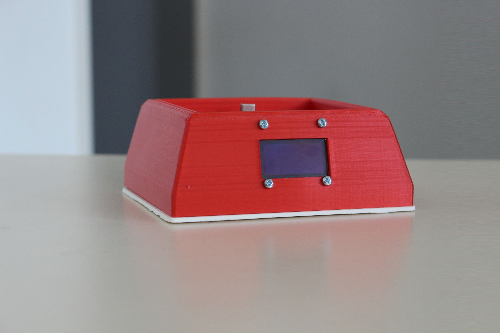
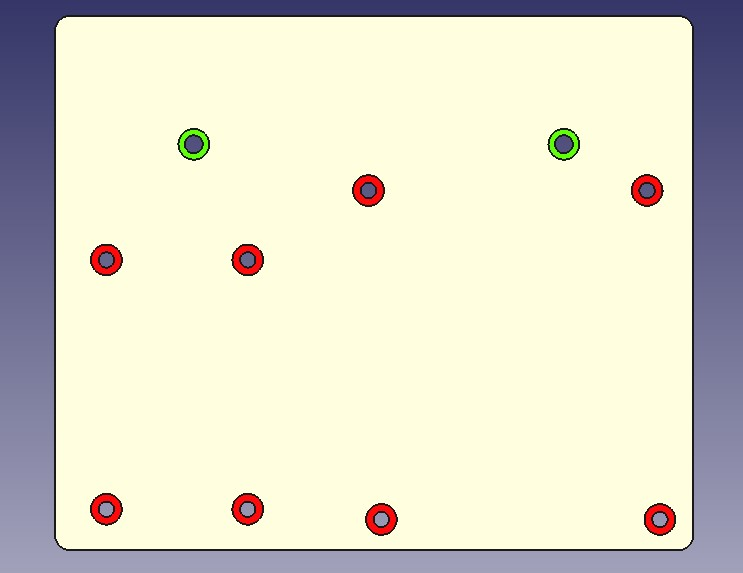
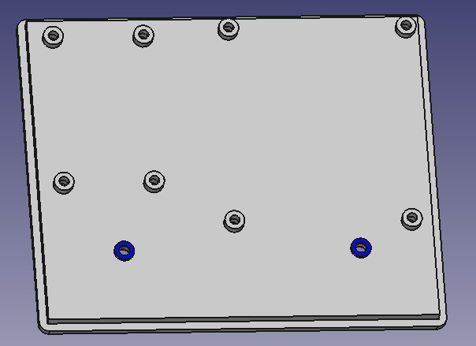
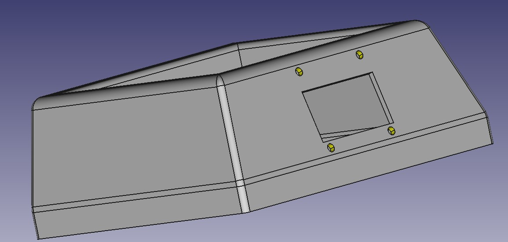
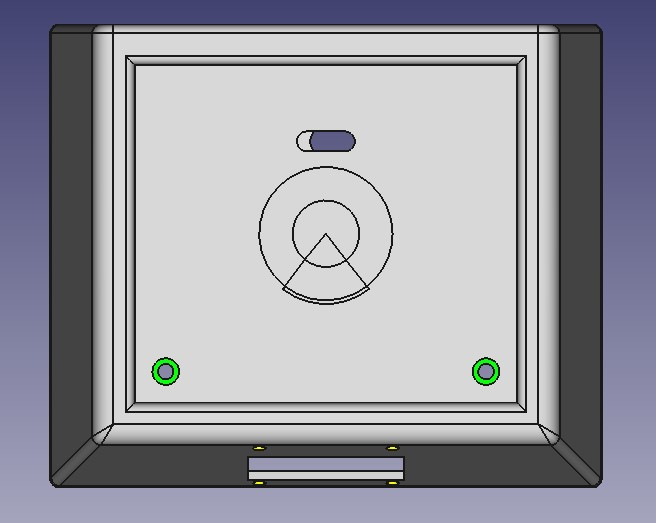

<h1>CASPA-PICO Dock</h1>
<h4>Cette section regroupe les fichiers sources du modèle 3D du dock pour le CASPA-PICO</h4>

<h2>Logiciels utilisés</h2>
<h4>Nous avons utilisés un logiciel gratuit et opensource : FreeCAD</h4>
<h2>Outils et visseries</h2>
<ul>
  <li>1x Tournevis</li>
  <li>8x vis M2,5 12mm</li>
  <li>4x vis M2,5 8mm</li>
  <li>4x vis M3 10mm</li>
  <li>12x écrou M2,5</li>
  <li>2x entretoise filetée M3 30mm Femelle/Femelle</li>
</ul>
<h2>Montage</h2>
<h3>Légende :<h3>
<ul>
  <li>Rouge : vis M2,5 12mm</li>
  <li>Jaune : vis M2,5 8mm</li>
  <li>Vert  : vis M3 10mm</li>
  <li>Bleu  : entretoise filetée M3 30mm Femelle/Femelle</li>
<u/l>

   

   

   
 
